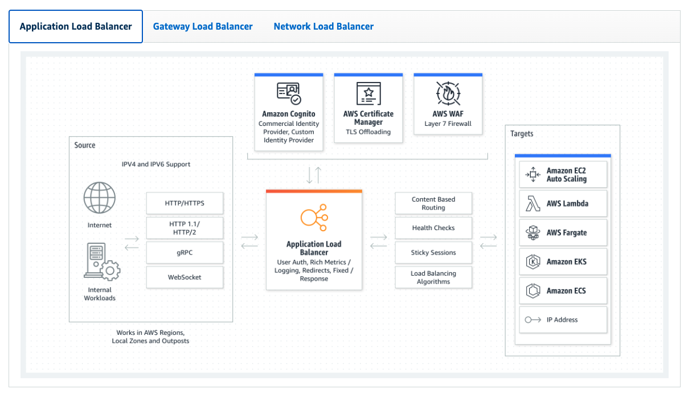
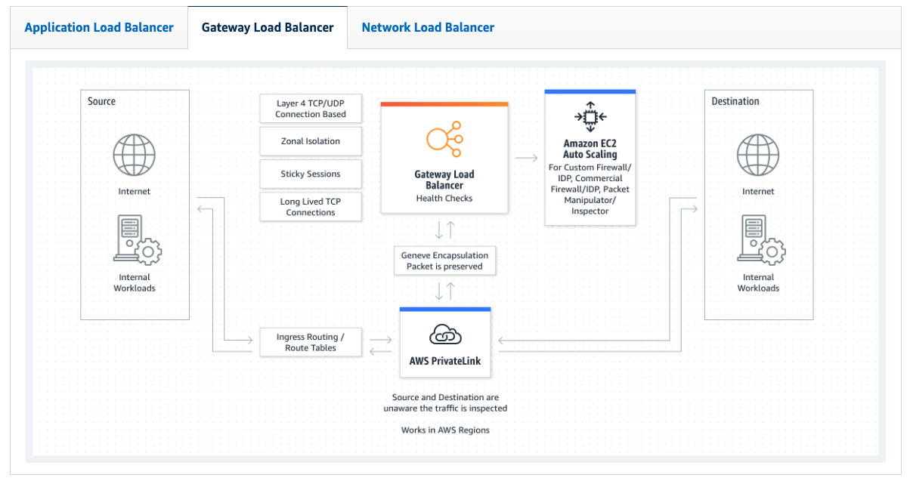
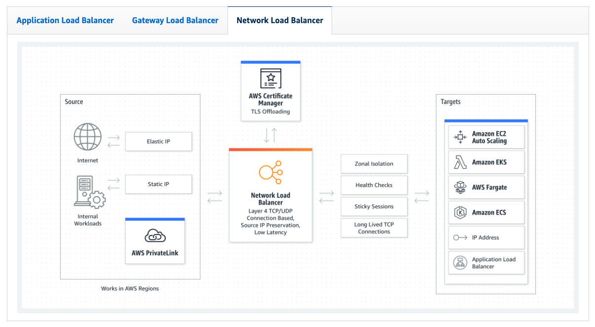

# Elastic Load Balancer

Elastic Load Balancing (ELB) automatically distributes incoming application traffic across multiple targets and virtual appliances in one or more Availability Zones (AZs).

## Application Load Balancer

## Gateway Load Balancer

## Network Load Balancer

